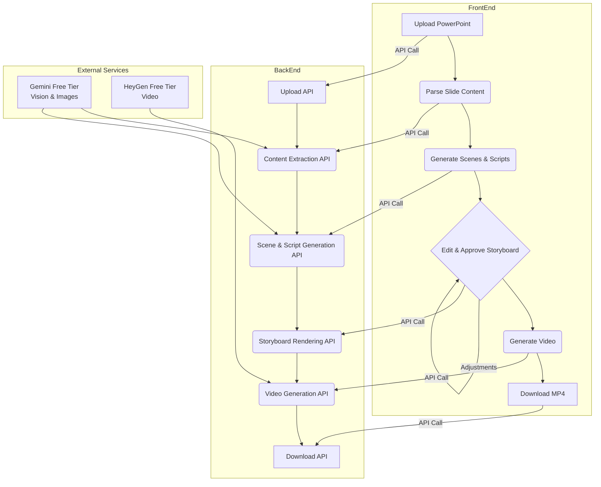

# Presentation to Video Conversion System

<div style="display: flex; justify-content: space-around;">
  <video width="320" height="240" controls>
    <source src="data/demo.mp4" type="video/mp4">
    Your browser does not support the video tag.
  </video>
  <video width="320" height="240" controls>
    <source src="data/aa69986ec9044d7d91be597b30b60655.mp4" type="video/mp4">
    Your browser does not support the video tag.
  </video>
</div>
This project is a full-stack application that converts PowerPoint presentations into engaging videos using AI-generated visuals and speech. It includes a **React-based front-end** and a **FastAPI-based back-end**.

---

## Table of Contents

1. [Setup Instructions](#setup-instructions)
2. [Architecture Overview](#architecture-overview)
3. [Technical Details](#technical-details)
4. [Mermaid Flowchart](#mermaid-flowchart)

---

## Setup Instructions

### Prerequisites

- **Node.js** (v16 or higher)
- **Python** (v3.10 or higher)
- **pip** (Python package manager)
- **Virtual Environment** (optional but recommended)

Clone the repositor

```bash
    git clone https://github.com/Tsegaye16/Video-generator
```

### Back-End Setup

1. Navigate to the `Video-generator/server` directory:
   ```bash
   <!-- cd Video-generator/server -->
   ```
2. Create a virtual environment and activate it:

   ```bash
   python -m venv .venv
   source .venv/bin/activate # On Windows: .venv\Scripts\activate
   ```

3. Install dependency:

```bash
pip install -r requirements.txt
```

4. Create a `.env` file in the `server` directory and configure the following keys:

   ```
   HEYGEN_API_KEY=<your_heygen_api_key>
   GOOGLE_GENAI_API_KEY=<your_google_genai_api_key>
   CLOUDINARY_CLOUD_NAME=<your_cloudinary_cloud_name>
   CLOUDINARY_API_KEY=<your_cloudinary_api_key>
   CLOUDINARY_API_SECRET=<your_cloudinary_api_secret>
   ```

5. Start the back-end server:

```bash
uvicorn main:app --reload
```

### Front-End Setup

1. Navigate to the `Video-generator/client` directory:

```bash
    cd Video-generator/client
```

1. Install dependencies:

```bash
    npm install
```

3. Start the development server:

```bash
    npm start
```

4. Open the application in your browser

---

## Architecture Overview

#### High-Level Architecture

The system consists of:

1. Front-End: A React-based UI for uploading PowerPoint files, reviewing AI-generated scenes, and customizing the final video.
2. Back-End: A FastAPI server that handles file uploads, content extraction, AI-based scene generation, and video creation.
3. Third-Party APIs:
   - **Google Generative AI:** For generating speech scripts and image prompts.
   - **HeyGen API:** For creating videos with avatars and voiceovers.
   - **Cloudinary:** For storing and serving generated images.

---

### Technical Details

Back-End

- **Framework:** FastAPI
- **Key Features:**
  - File upload and validation (`upload.py`)
  - Content extraction from PowerPoint files (`extract.py`)
  - AI-based scene generation (`generate.py`)
  - Video generation using HeyGen API (`video.py`)
- **Configuration:** Managed via environment variables in `config.py`.

Front-End

- **Framework:** React
- **Key Features:** - Drag-and-drop file upload (`UploadStep.js`) - Scene review and customization (`ReviewStep.js`)
  Video preview and download (`VideoResult.js`)
  **Styling:** Styled Components and Ant Design.

---


